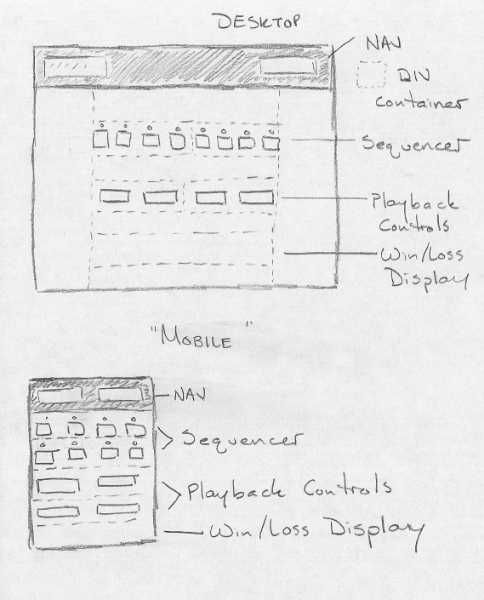

#I've Got Rhythm...
This is a simple variation on "Simon" written using HTML, CSS and vanilla JS.

The basic idea of this game is that the computer will play you a single note over a sequence of eight steps. The player is meant to input the rhythm on a series of buttons on a sequencer representing each step.

In a past life, I ran a small studio teaching guitar lessons in New York City and saw about seventy private students each week. One of the things I always wish I'd had was an effective tool to help teach not only reading rhythm, but also some ear-training as well. One of my larger breakthroughs as a music teacher was finding that students responded really well to play-alongs. I had built, at the time, an entire series of online lesson supplements to present exactly that, but always wished that they had a greater degree of interactivity.

For now, this was a fun and interesting project to work on, but in the future the plan is to continue to make it more robust and to have it function either as a standalone tool or something that can be easily integrated into specific lesson plans.

#Technologies Used
-HTML5
-CSS3
-"Vanilla" Javascript

#Approach
I used HTML global data attributes fairly extensively here. Each sequencer key has a "data-index" attribute which corresponds to the index it represents in the audio sequencer arrays. Each audio sample also has its own "data-note" attribute. When any of the sequencer keys are toggled in the user controls, they perform two actions. First, they toggle a CSS class on that key to indicate that whether its "active" or not. Second, a function takes the "data-index" value of the sequencer key and looks for the corresponding step in the user's sequencer array. Then, depending on whether that key is "active", it either pushes or pops an audio sample's "data" value to/from the array at that index.

#Citations
The genesis of this idea came from a Wes Bos tutorial on binding audio playback to keypress events. Whenever a key would be pressed, a corresponding drum would play and a div with the key and drum name would become animated briefly, by changing some color, box-shadow and sizing properties over a <10ms transition and then reverting to its original state once the transition ended.

Since I can't play a 'qwerty' keyboard with any degree of rhythm, I decided to see if I could build drum sequencing functionality into the project. It was successful and a lot of the concepts (although surprisingly fewer than expected) were borrowed to create this game.

The one place where I directly copied the original tutorial's code was in the 'transitioned' events that end animations. I wasn't entirely familiar with that method of animating div elements, and it seems to have worked perfectly fine.

#How To Use
The goal of the game is to correctly enter a rhythm into a sequencer which matches the one that the game provides for you.

Players should begin by clicking the "play" button in order to hear the rhythm they need to match. They can halt playback by clicking on the "stop" button.

Once the player is ready, they can begin entering their sequence on the row of eight sequencer keys, and then click "submit" to check their answer. Clicking "submit" will inform the user if they're correct or not.

If a player succeeds in matching the computer's sequence, an overlay screen appears offering the chance to play again, at which point both sequencers are reset- the computer to a new value, and the user to a blank row of keys.

#User Stories
A player should be able to:

* Play and Pause an audio sequence
* Enter their sequence on a grid of keys displayed on screen
* Check to see if their answer was right
* Adjust playback speed
* Reset the sequence and play again if they win
* Quit the game and go do something else

#Wireframe

#Unsolved Problems
* JS didn't (doesn't?) execute in Safari
* Input field display is a little strange on mobile
* Game can be expanded to include:
  * Randomized rhythmic phrases
  * Scalable difficulty (16th notes phrases, multi-bar phrases, multiple sample tracks)
  * "Practice Mode" (Just go play with a drum sequencer... its already built, after all.
* The UI could be styled so much better...
